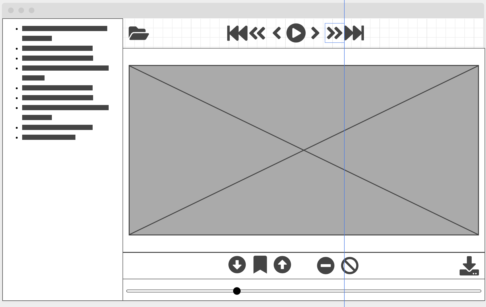

# video_splitter_app
App for splitting videos into smaller videos

# Functionality

1. Load single video or videos in folder 
	- open first video in video view
2. Analyse the opened video for science changes and set marks accordingly
3. Allow user to manipulate marks and export of split video 
4. Batch splits input videos and export video parts
